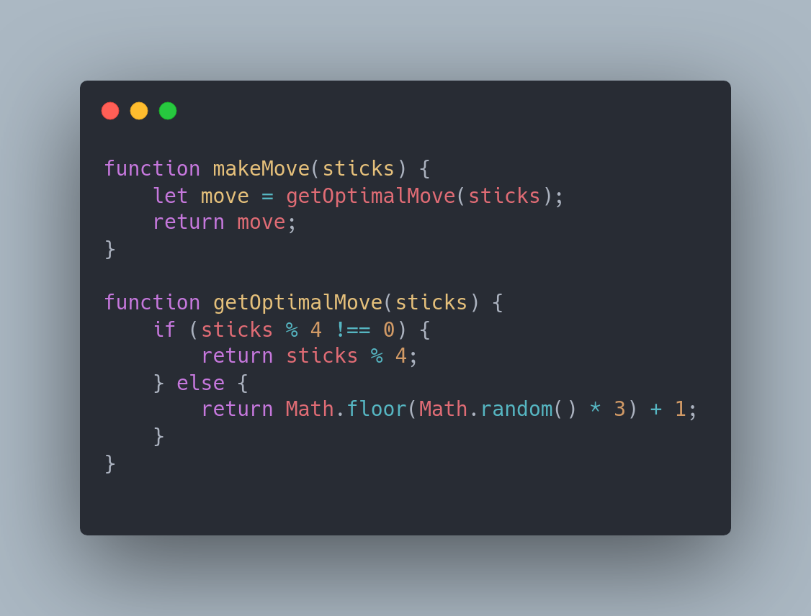

# 21 palitos

###### O objetivo do jogo e vencer sempre, como fazer isto ? 

###### this is the code solution:

 

Este código é uma solução para o jogo de 21 palitos, onde dois jogadores jogam alternadamente, tirando 1, 2 ou 3 palitos por vez. O objetivo é ser o último a pegar um palito e vencer o jogo.

A função principal é a makeMove(sticks). Ela recebe o número atual de palitos como parâmetro e chama a função getOptimalMove(sticks) para determinar a melhor jogada. Essa função getOptimalMove retorna a jogada ótima, que é deixar o oponente com um múltiplo de 4 palitos. Se isso não for possível, ele escolhe um número aleatório de palitos entre 1 e 3.

A função makeMove retorna a jogada escolhida pelo jogador, que pode ser utilizada no loop principal do jogo para controlar as jogadas e o estado do jogo.

Esse código fornece apenas uma implementação da lógica para a jogada ótima. Para jogar o jogo com dois jogadores humanos ou com jogadores adicionais, você precisaria adicionar outras lógicas de jogo e controlar o fluxo do jogo.
