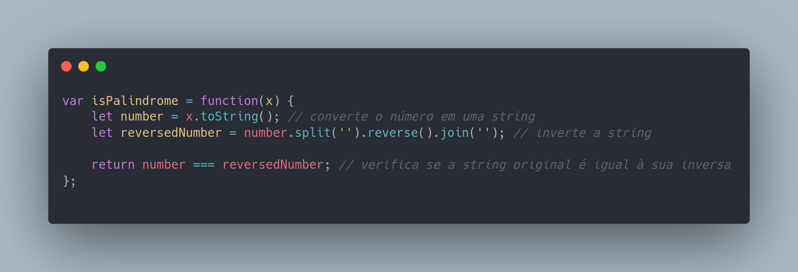
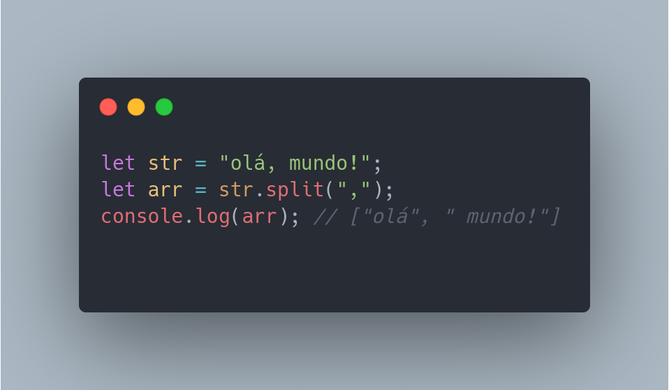

# isPalindromo?

### what i have to do ? 

###### oh ya, resolve this challenge:

Given an integer x, return true if x is a 
palindrome
, and false otherwise

###### so...

###### Em portugues, que diacho e isso ? bom e simples de entender:

Para entender este desafio, primeiro é importante saber o que é um palíndromo. Um palíndromo é uma palavra, número ou frase que pode ser lido da mesma forma de trás para frente e de frente para trás.

Por exemplo, as palavras "reler", "osso" e "radar" são palíndromos, porque podem ser lidas tanto da esquerda para a direita quanto da direita para a esquerda e ainda assim ter o mesmo significado.

No caso deste desafio, você precisa criar uma função que recebe um número inteiro como argumento e determina se esse número é um palíndromo ou não. Você pode fazer isso convertendo o número em uma string e verificando se a string é igual à sua inversa.

Por exemplo, se o número de entrada for 12321, você pode converter esse número em uma string "12321" e verificar se ela é igual à sua inversa "12321". Se for igual, então o número é um palíndromo. Caso contrário, o número não é um palíndromo.

Lembre-se que não é necessário dar a resposta diretamente, mas espero que isso ajude você a entender o que é um palíndromo e como abordar esse desafio.

Nesta solução, usamos o método toString() para converter o número em uma string e, em seguida, usamos os métodos split(), reverse() e join() para inverter a string. Em seguida, comparamos a string original com a sua inversa usando o operador de igualdade === e retornamos true se forem iguais e false caso contrário.

###### Oque split faz mesmo ? 

Em JavaScript, o método split() é usado para dividir uma string em um array de substrings com base em um separador especificado. O separador pode ser um caractere ou uma expressão regular.

Por exemplo, o seguinte código divide a string "olá, mundo!" em um array de substrings com base no separador ","

###### O metodo reverse so funciona em array, por isso usamos o metodo split ?

Sim, isso mesmo! O método reverse() só funciona em arrays, e não em strings. Portanto, para inverter uma string em JavaScript, é necessário primeiro convertê-la em um array, usando o método split(), e em seguida inverter o array com o método reverse(), antes de juntar os elementos novamente em uma string com o método join().

Por exemplo, o seguinte código inverte a string "hello" usando os métodos split(), reverse() e join():

