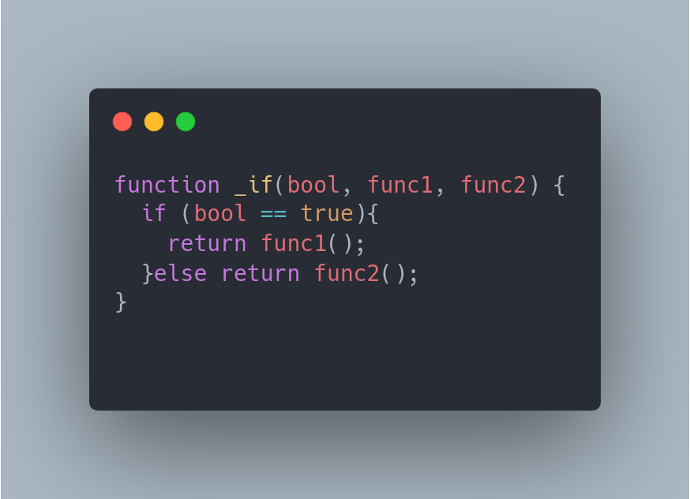
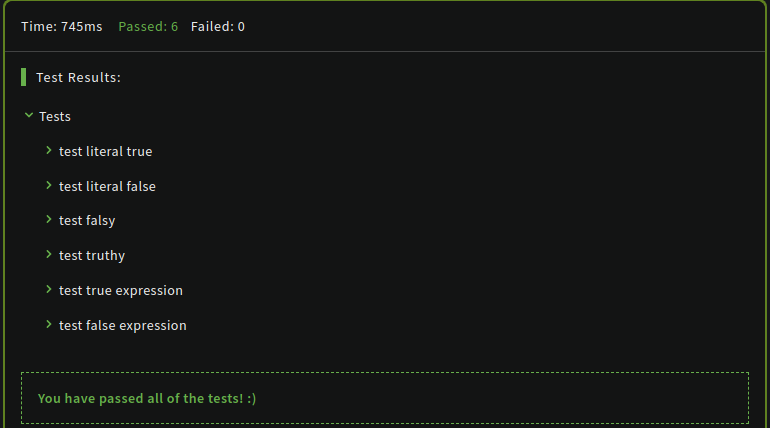

# Usando uma condicional que chama um funcao

Create a function called _if which takes 3 arguments: a value bool and 2 functions (which do not take any parameters): func1 and func2

When bool is truthy, func1 should be called, otherwise call the func2.

###### RESOLUTION

consegui passar este leve desafio :) o nivel vai subir aos poucos.

